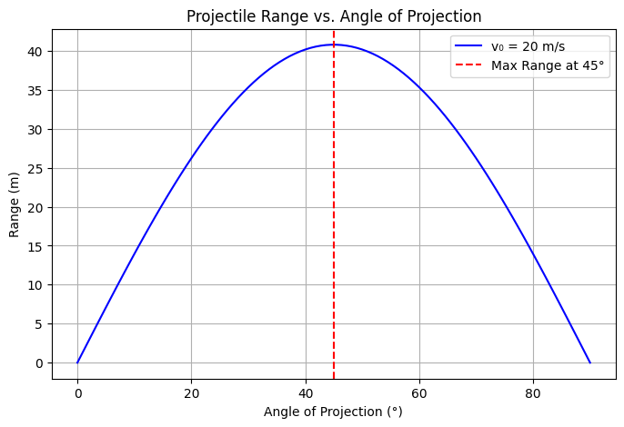
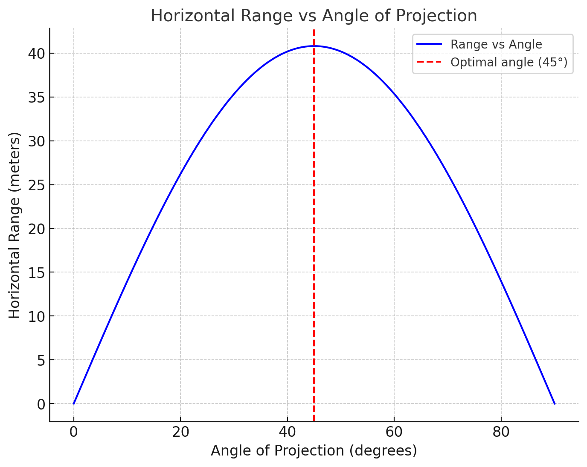

# Problem 1

# **Investigating the Range as a Function of the Angle of Projection**  

### Theoretical Foundation:

In projectile motion, the **range** of a projectile is the horizontal distance it travels before hitting the ground. The range depends on several factors, including the **initial velocity (v₀)**, the **angle of projection (\( \theta \))**, and the **acceleration due to gravity (g)**. The study of how range varies with angle helps in optimizing launch conditions for various applications, such as sports, military ballistics, and engineering.

#### **Mathematical Representation**  
The equation for the range (\( R \)) of a projectile launched from the ground with an initial velocity \( v_0 \) at an angle \( \theta \) is given by:

$$
R = \frac{v_0^2 \sin(2\theta)}{g}
$$

where:  
- \( v_0 \) = initial velocity,  
- \( \theta \) = angle of projection,  
- \( g \) = acceleration due to gravity (9.81 m/s² on Earth),  
- \( \sin(2\theta) \) = the sine of twice the launch angle.

#### **Key Observations**  
1. **Maximum Range**: The maximum range is achieved when \( \theta = 45^\circ \), because \( \sin(90^\circ) = 1 \), which is the highest possible value for the sine function.  
2. **Symmetry**: The range for angles \( \theta \) and \( 90^\circ - \theta \) is the same (e.g., 30° and 60° give the same range).  
3. **Dependence on Initial Velocity**: Higher launch speeds increase the range quadratically (\( v_0^2 \) relationship).  

---

### **Theoretical Foundation**  

Projectile motion follows Newton’s laws of motion, assuming no air resistance. The motion can be decomposed into two independent components:  

1. **Horizontal Motion**  
   - Constant velocity: \( v_x = v_0 \cos\theta \)  
   - Distance traveled: \( x = v_0 \cos\theta \cdot t \)  

2. **Vertical Motion**  
   - Accelerated motion under gravity: \( v_y = v_0 \sin\theta - gt \)  
   - Time to reach max height: \( t_{\text{up}} = \frac{v_0 \sin\theta}{g} \)  
   - Total flight time: \( T = \frac{2v_0 \sin\theta}{g} \)  

Since the range is determined by both horizontal velocity and time of flight, the product of these values gives the range formula.  

### **Applications**  
- **Sports**: Optimizing throwing angles in javelin, shot put, or basketball.  
- **Engineering**: Designing launch angles for projectiles or water fountains.  
- **Military**: Calculating artillery firing angles for maximum efficiency.  

Would you like a more detailed breakdown of any specific aspect?

```python
import numpy as np
import matplotlib.pyplot as plt

# Constants
g = 9.81  # Acceleration due to gravity (m/s²)
v0 = 20   # Initial velocity (m/s)

# Angles from 0 to 90 degrees
angles = np.linspace(0, 90, 100)  # Generate 100 points between 0 and 90 degrees
theta_rad = np.radians(angles)  # Convert degrees to radians

# Compute range for each angle
ranges = (v0**2 * np.sin(2 * theta_rad)) / g

# Plot the results
plt.figure(figsize=(8, 5))
plt.plot(angles, ranges, label=f'v₀ = {v0} m/s', color='b')
plt.axvline(45, color='r', linestyle='--', label='Max Range at 45°')

# Labels and Title
plt.xlabel('Angle of Projection (°)')
plt.ylabel('Range (m)')
plt.title('Projectile Range vs. Angle of Projection')
plt.legend()
plt.grid()

# Show the plot
plt.show()

```



To understand how the horizontal range of a projectile depends on the angle of projection, we need to break down the problem into key physics concepts, focusing on projectile motion.

### 1. **Horizontal Range and Angle of Projection:**

The **horizontal range** $R$ is the distance traveled by a projectile along the horizontal axis before it returns to the same vertical level from which it was launched. The range is influenced primarily by the initial velocity, the angle of projection, and gravitational acceleration.

The formula for the horizontal range $R$ of a projectile launched from the ground is given by:

$$
R = \frac{v_0^2 \sin(2\theta)}{g}
$$

Where:
- $v_0$ is the initial velocity of the projectile.
- $\theta$ is the angle of projection.
- $g$ is the acceleration due to gravity.

#### **Key Observations:**
- The horizontal range is proportional to the square of the initial velocity, $v_0^2$, and the sine of twice the projection angle, $\sin(2\theta)$.
- The range is **maximized** when the angle of projection $\theta = 45^\circ$, because $\sin(90^\circ) = 1$ gives the maximum value for the sine function.
- At $\theta = 0^\circ$ or $\theta = 90^\circ$, the range is zero. This is because, at $\theta = 0^\circ$, the projectile moves horizontally without any vertical motion (no time in the air), and at $\theta = 90^\circ$, the projectile moves straight up and then comes back down without traveling horizontally.

### 2. **Effect of Changes in Initial Velocity:**

From the range equation, we can see that the horizontal range depends on the **square of the initial velocity**. This means:
- **Increasing the initial velocity $v_0$** will increase the horizontal range. If you double the velocity, the range will increase by a factor of four.
- Conversely, decreasing the velocity will reduce the range.

This relationship suggests that the faster a projectile is launched, the farther it will travel horizontally, assuming the angle of projection remains optimal (around 45°).

### 3. **Effect of Gravitational Acceleration:**

The horizontal range is inversely proportional to the gravitational acceleration $g$, meaning:
- **Increasing gravitational acceleration (like on a planet with stronger gravity)** will reduce the range. The projectile will spend less time in the air, so the horizontal distance it travels will be shorter.
- **Decreasing gravitational acceleration (like on the Moon, where gravity is weaker than on Earth)** will increase the range. The projectile stays in the air for a longer period, traveling a greater horizontal distance.

This explains why the range of a projectile is different on different planets, where the value of $g$ varies (on Earth, $g \approx 9.8 \, m/s^2$, on the Moon, $g \approx 1.6 \, m/s^2$).

### 4. **Summary of Factors Affecting Range:**

- **Angle of Projection**: The range is maximized at 45° and decreases as the angle moves away from 45° in either direction (towards 0° or 90°).
- **Initial Velocity**: The range increases with the square of the initial velocity.
- **Gravitational Acceleration**: The range decreases as gravitational acceleration increases.

### 5. **Practical Examples:**
- **On Earth**: If you increase the initial velocity from 10 m/s to 20 m/s while keeping the angle at 45°, the range will increase by a factor of 4.
- **On the Moon**: If you use the same initial velocity and angle, the range on the Moon will be significantly greater than on Earth due to the lower gravitational acceleration.

In conclusion, the horizontal range of a projectile is highly sensitive to both the angle of projection and the initial velocity. Gravitational acceleration also plays a significant role in determining how far a projectile will travel, with lower gravity leading to a longer range.


